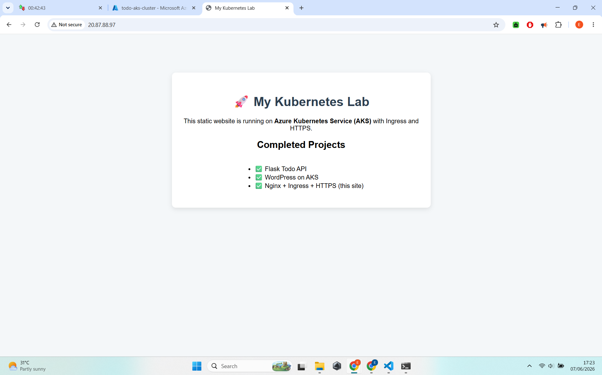
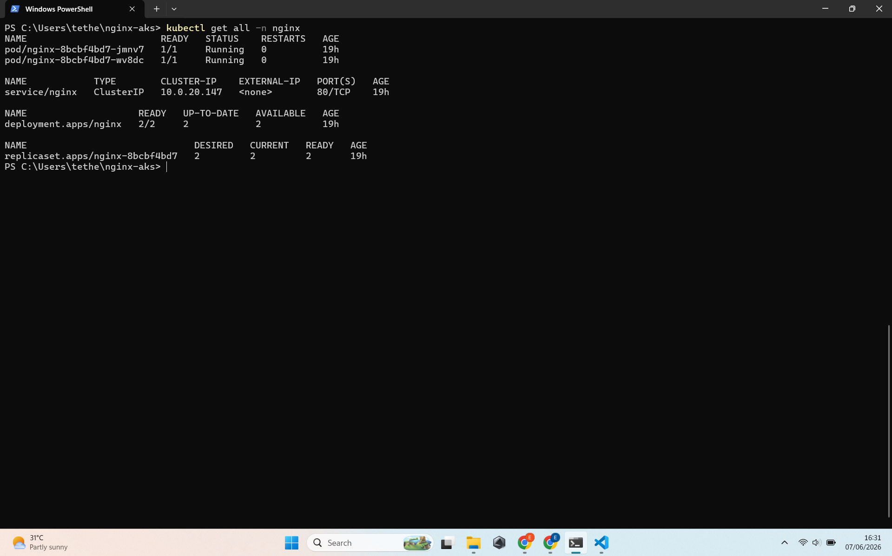
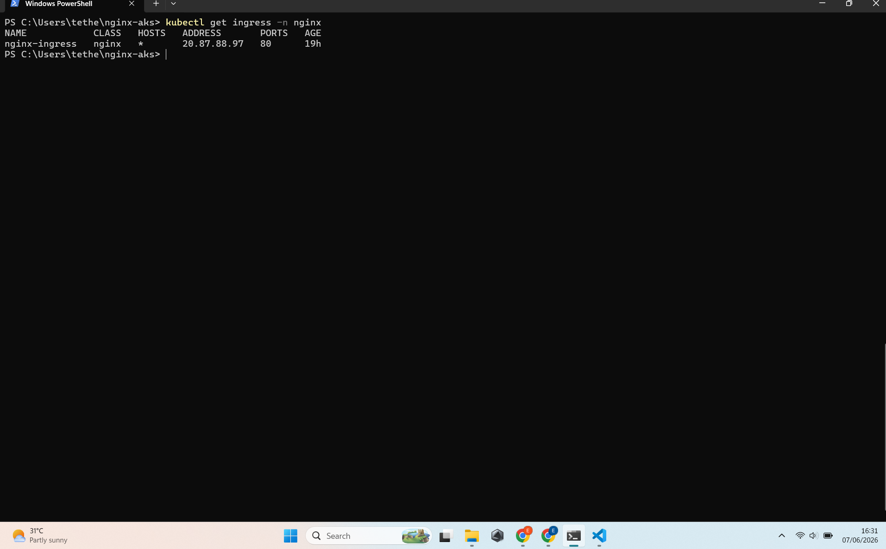
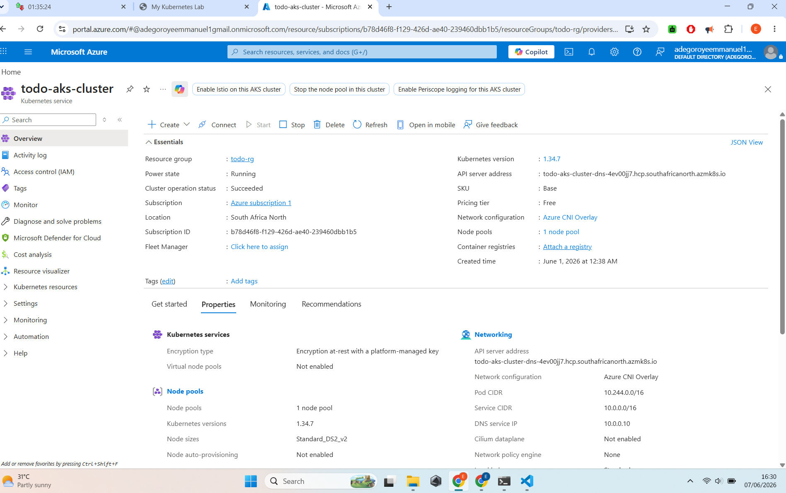

# 🚀 Nginx Static Website with Ingress on Azure AKS

A clean, static website deployed on Azure Kubernetes Service using Nginx and the NGINX Ingress Controller.



## ✨ Project Overview

This project demonstrates how to deploy a static website on Kubernetes with proper routing using Ingress.

**Live URL:** http://20.87.88.97

## 🛠️ Tech Stack

- **Web Server**: Nginx (alpine)
- **Routing**: Kubernetes Ingress + NGINX Ingress Controller (via Helm)
- **Cloud**: Azure Kubernetes Service (AKS)
- **Content**: Static HTML + CSS served via ConfigMap

## 📸 Screenshots

  
*Clean static website served via Ingress*

  
*Deployments, Services and Ingress in the nginx namespace*

  
*Ingress resource showing routing rules*

  
*AKS Cluster Overview*

## Key Concepts Demonstrated

- Deploying static content using ConfigMap
- Installing and configuring NGINX Ingress Controller
- Using Ingress to route external traffic
- Clean separation between application and networking layers

## What I Learned

- How Ingress works in Kubernetes
- Difference between Service and Ingress
- Installing add-ons using Helm
- Exposing applications professionally on AKS

## How to Deploy

```bash
kubectl apply -f k8s/
